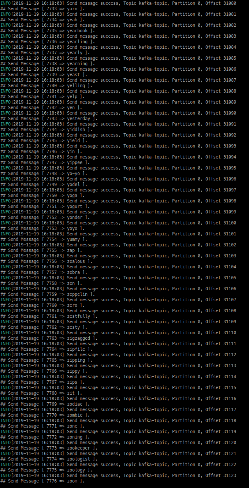
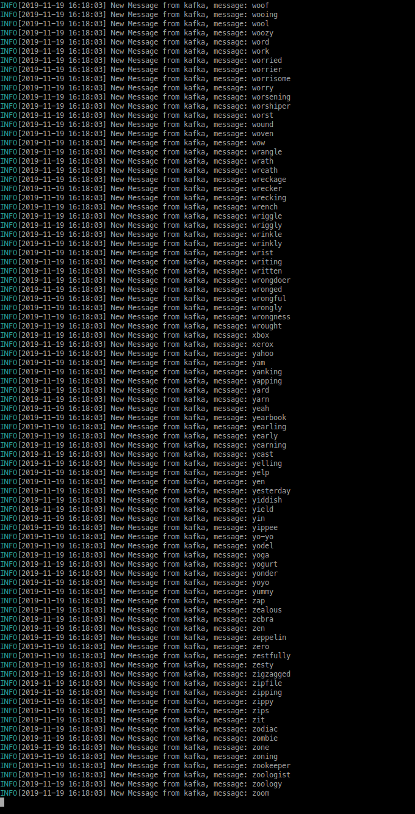

## Learn Kafka
Learning kafka using Go and library shopify sarama

### Running Snapshot

#### Kafka Publisher


#### Kafka Consumer


### Publisher
* Using wordlist `word.txt` for dummy publish message

### Running
* Setup docker container
  ```
  bash run-docker.sh
  ```

* Setup topic name
  ```
  export KAFKA_TOPIC="kafka-topic"
  ```

* Setup hosts
  ```
  vi /etc/hosts
  ----
  127.0.0.1  zeroc0d3_kafka   # container_name
  ```

* Install Dependencies
  ```
  make setup
  ```

* Build Producer
  ```
  make build-producer
  ```

* Build Consumer
  ```
  make build-consumer
  ```

* Run Producer
  ```
  make run-producer
  ```

* Run Consumer
  ```
  make run-consumer
  ```

### Copyright
* Author : **Dwi Fahni Denni (@zeroc0d3)**
* License: **Apache ver-2**